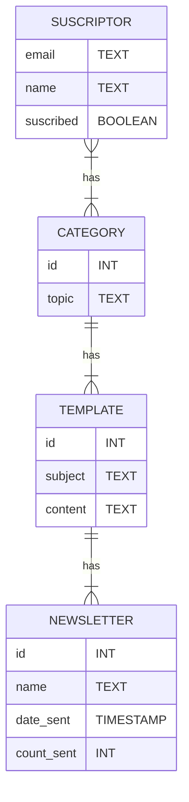

# Codecraft REST API

An API developed with Django REST Framework using Postgres as database.

## Setup dev environment

To set up your environment you need to have installed docker with docker-compose v2

### 1. Build docker image

At the root of this project run

```bash
docker build .
```

### 2. Setup environment variables

Copy the file `.env.example` and name it `.env`

```bash
cp .env.example .env
```

and create a password for your database user in the `.env` file.

```bash
POSTGRES_PASSWORD="YOUR PASSWORD"
```

The user and database name for default is **codecraft**.

### 3. Up the services

All the dev environment is running in docker so you need to up all the services using.

```bash
docker compose up
```

### 4. Manage packages locally with venv (optional)

If you want to handle your python packages locally outside the docker container you need to create a virtual env using the `requirements.txt` file and then activate them. To do this execute:

**Create virual env**
```bash
python -m venv .venv
```

**Activate the virtual env**
```bash
source .venv/bin/activate
```

**Install local packages**
```bash
pip install -r requirements.txt
```

## ER Diagram

